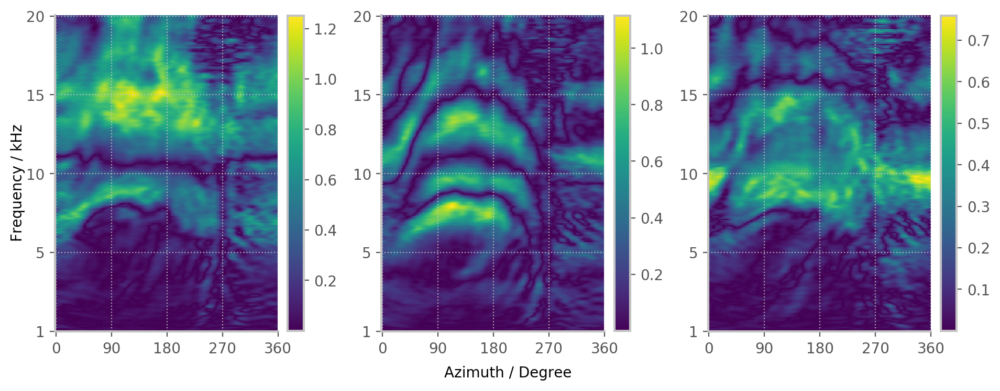

Documentation
========

Code Repository for the paper:

Eigen-Images of Head-Related Transfer Functions
------------------------------------------------------
Christoph Hold, Fabian Seipel, Fabian Brinkmann, Athanasios Lykartsis, and Stefan Weinzierl

Presented at the 143rd AES Convention, New York, NY, USA


```python
# Show plots, high resolution
%matplotlib inline
%config InlineBackend.figure_format = 'retina'
```


```python
%run ../01_code/imagePCA.py
```





